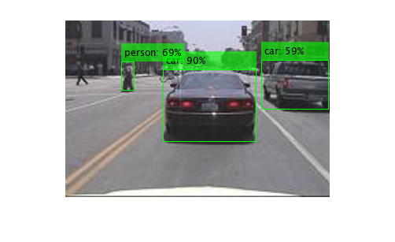
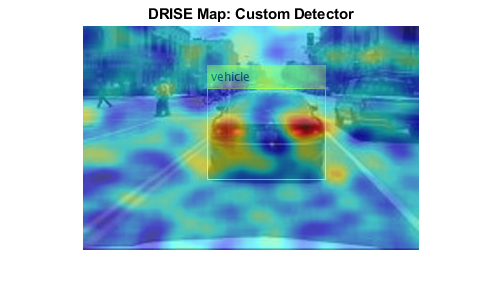
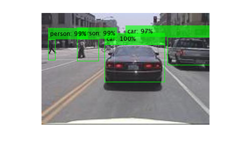

[](https://matlab.mathworks.com/open/github/v1?repo=matlab-deep-learning/object-detection-and-explainability-for-tensorflow-and-pytorch-models)

# Object Detection and Explainability in MATLAB for TensorFlow and PyTorch Models

This repository contains two examples on how to use TensorFlow™ and PyTorch® models for object detection in MATLAB® and how to explain the models' decisions with D-RISE.
* Object Detection and Explainability with Imported TensorFlow Model
* Object Detection and Explainability with PyTorch Model Using Co-Execution


# Example 1: Object Detection and Explainability with Imported TensorFlow Model

This example shows how to import a TensorFlow model for object detection, how to use the imported model in MATLAB and visualize the detections, and how to use D\-RISE to explain the predictions of the model.

## Requirements

To run the following code, you need:

-  [MATLAB](https://www.mathworks.com/products/matlab.html) R2024a 
-  [Deep Learning Toolbox](https://www.mathworks.com/products/deep-learning.html)™ 
-  [Deep Learning Toolbox Converter for TensorFlow Models](https://www.mathworks.com/matlabcentral/fileexchange/64649-deep-learning-toolbox-converter-for-tensorflow-models)™
-  [Computer Vision Toolbox](https://www.mathworks.com/products/computer-vision.html)™  

## Import and Initialize Network

Import a pretrained TensorFlow model for object detection. The model is in the SavedModel format. You can get the model from the [TensorFlow 2 Detection Model Zoo](https://github.com/tensorflow/models/blob/master/research/object_detection/g3doc/tf2_detection_zoo.md).

```matlab
modelFolder = "centernet_resnet50_v2_512x517_coco17";
detector = importNetworkFromTensorFlow(modelFolder);
```

```matlabTextOutput
Importing the saved model...
Translating the model, this may take a few minutes...
Import finished.
```

Specify the input size of the imported network. You can find the expected image size stated in the name of the TensorFlow network. The data format of the `dlarray` object must have the dimensions `"SSCB"` (spatial, spatial, channel, batch) to represent a 2\-D image input. For more information, see [Data Formats for Prediction with dlnetwork](https://www.mathworks.com/help/deeplearning/ug/tips-on-importing-models-from-tensorflow-pytorch-and-onnx.html#mw_b48d26e1-7484-4802-aef3-502f61c36795). Initialize the imported network.

```matlab
input_size = [512 512 3];
detector = detector.initialize(dlarray(ones(512,512,3,1),"SSCB"))
```

```matlabTextOutput
detector = 
  dlnetwork with properties:

         Layers: [1x1 centernet_resnet50_v2_512x517_coco17.kCall11498]
    Connections: [0x2 table]
     Learnables: [388x3 table]
          State: [0x3 table]
     InputNames: {'kCall11498'}
    OutputNames: {'kCall11498/detection_boxes'  'kCall11498/detection_classes'  'kCall11498/detection_scores'  'kCall11498/num_detections'}
    Initialized: 1

  View summary with summary.

```

Save the imported network, so you don't have to re\-import the TensorFlow model if you want to run the following sections independently.

```matlab
save("centernet_object_detector","detector","-v7.3")
```
## Detect with Imported Network

Optionally, load the imported network. The network has four outputs: bounding boxes, classes, scores, and number of detections.

```matlab
%load("centernet_object_detector.mat")
mlOutputNames = detector.OutputNames'
```

```matlabTextOutput
mlOutputNames = 4x1 cell    
'kCall11498/detection_boxes'  
'kCall11498/detection_classes'
'kCall11498/detection_scores' 
'kCall11498/num_detections'   

```

Read the image that you want to use for object detection. Perform object detection on the image.

```matlab
img = imread("testCar.png");
[y1,y2,y3,y4] = detector.predict(dlarray(single(img),"SSCB"));
```
## Get Detections with Highest Scores

Create a map of all the network outputs.

```matlab
mlOutputMap = containers.Map;
mlOutputs = {y1,y2,y3,y4};
for i = 1:numel(mlOutputNames)
    opNameStrSplit = strsplit(mlOutputNames{i},'/');
    opName = opNameStrSplit{end};
    mlOutputMap(opName) = mlOutputs{i};
end
```

Get the detections with scores above the threshold `thr`, and the corresponding class labels.

```matlab
thr = 0.5;
[bboxes,classes,scores,num_box] = bestDetections(img,mlOutputMap,thr);
class_labels = getClassLabels(classes);
```
## Visualize Object Detection

Create the labels associated with each of the detected objects.

```matlab
colons = repmat(": ",[1 num_box]);
percents = repmat("%",[1 num_box]);
labels = strcat(class_labels,colons,string(round(scores*100)),percents);
```

Visualize the object detection results with annotations.

```matlab
figure
outputImage = insertObjectAnnotation(img,"rectangle",bboxes,labels,LineWidth=1,Color="green");
imshow(outputImage)
```



## Explainability for Object Detector

Explain the predictions of the object detection network using D\-RISE. Specify a custom detection function to use D\-RISE with the imported TensorFlow network.

```matlab
targetBox = bboxes(1,:);
targetLabel = 1;
scoreMap = drise(@(img)customDetector(img),img,targetBox,targetLabel);
```

Plot the results.

```matlab
figure
annotatedImage = insertObjectAnnotation(img,"rectangle",targetBox,"vehicle");
imshow(annotatedImage)
hold on
imagesc(scoreMap,AlphaData=0.5)
title("DRISE Map: Custom Detector")
hold off
colormap jet
```




# Example 2: Object Detection and Explainability with PyTorch Model Using Co\-Execution

This example shows how to perform object detection with a PyTorch model using co\-execution, and how to use D\-RISE to explain the predictions of the PyTorch model.

## Requirements

To run the following code, you need:

-  [MATLAB](https://www.mathworks.com/products/matlab.html) R2024a 
-  [Computer Vision Toolbox](https://www.mathworks.com/products/computer-vision.html) 
-  [Python](https://www.python.org/)® (tested with 3.11.2) 
-  [PyTorch](https://pytorch.org/) (tested with 2.2.0) 
-  [TorchVision](https://pytorch.org/vision/stable/index.html) (tested with 0.17.0) 
-  [NumPy](https://numpy.org/) (tested with 1.26.4) 

## Python Environment

Set up the Python environment by first running commands at a command prompt (Windows® machine) and then, set up the Python interpreter in MATLAB.


Go to your working folder. Create the Python virtual environment `venv` in a command prompt outside MATLAB. If you have multiple versions of Python installed, you can specify which Python version to use for your virtual environment.

```
python -m venv env
```

Activate the Python virtual environment `env` in your working folder.

```
env\Scripts\activate
```

Install the necessary Python libraries for this example. Check the installed versions of the libraries.

```
pip install torchvision
python -m pip show torchvision
```

Set up the Python interpreter for MATLAB® by using the [`pyenv`](https://www.mathworks.com/help/matlab/ref/pyenv.html) function. Specify the version of Python to use.

```matlab
pe = pyenv(Version=".\env\Scripts\python.exe",ExecutionMode="OutOfProcess")
```

```matlabTextOutput
pe = 
  PythonEnvironment with properties:

          Version: "3.11"
       Executable: "C:\Users\sparaske\OneDrive - MathWorks\Documents\AI_Customers\Demos\PyTorch_object_detection\code\env\Scripts\python.exe"
          Library: "C:\Users\sparaske\AppData\Local\Programs\Python\Python311\python311.dll"
             Home: "C:\Users\sparaske\OneDrive - MathWorks\Documents\AI_Customers\Demos\PyTorch_object_detection\code\env"
           Status: NotLoaded
    ExecutionMode: OutOfProcess

```
## Object Detection

Read the image that you want to use for object detection.

```matlab
img_filename = "testCar.png";
img = imread(img_filename);
```

Perform object detection with a PyTorch model using co\-execution.

```matlab
pyrun("from PT_object_detection import loadPTmodel, detectPT")
[model,weights] = pyrun("[a,b] = loadPTmodel()",["a" "b"]);
predictions = pyrun("a = detectPT(b,c,d)","a",b=img,c=model,d=weights);
```

Convert the prediction outputs from Python data types to MATLAB data types.

```matlab
[bboxes,labels,scores] = convertVariables(predictions,imread(img_filename));
```

Get the class labels.

```matlab
class_labels = getClassLabels(labels);
```
## Visualization

Create the labels associated with each of the detected objects.

```matlab
num_box = length(scores);
colons = repmat(": ",[1 num_box]);
percents = repmat("%",[1 num_box]);
class_labels1 = strcat(class_labels,colons,string(round(scores'*100)),percents);
```

Visualize the object detection results with annotations.

```matlab
figure
outputImage = insertObjectAnnotation(img,"rectangle",bboxes,class_labels1,LineWidth=1,Color="green");
imshow(outputImage)
```



## Explainability

Explain the predictions of the PyTorch model using D\-RISE. Specify a custom detection function to use D\-RISE.

```matlab
targetBbox = bboxes(1,:);
targetLabel = 1;
scoreMap = drise(@(img)customDetector(img),img,targetBbox,targetLabel,...
    NumSamples=512,MiniBatchSize=8,Verbose=true);
```

```matlabTextOutput
Explaining 1 detections.
Number of mini-batches to process: 64
..........   ..........   ..........   ..........   .......... (50 mini-batches)
..........   ....                                              (64 mini-batches)
Total time = 1145.9secs.
```

Copyright 2024, The MathWorks, Inc.


